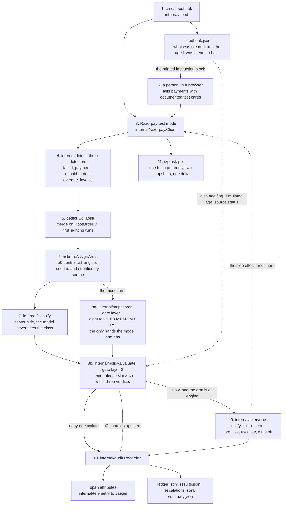

# Architecture

`rzp-recovery-agent` sweeps a Razorpay account for money that is owed and not
collected, decides one action per debt, and executes it through a policy gate
the decision maker cannot go around. Three detectors feed one queue, the queue
collapses the sightings that are the same debt, fifteen rules decide, and an
intervention engine with a closed action set does the rest. Every decision is an
append-only audit row carrying its rule id, a trace span as well in the MCP
path, and the containment claim is a counter that has to read zero rather than
a sentence in this document.

Written 2026-09-01 for the retry engine, rewritten 2026-09-05 for the
revenue-at-risk engine that replaced it. Read `docs/INDIA-CONSTRAINTS-AUDIT.md`
for why the retry action is gone, `/RESULTS.md` for the numbers,
`/HONEST-LIMITATIONS.md` for what they are not evidence of, and `docs/PRD.md`
for scope.

## The whole system

Two dotted lines out of the manifest are worth reading carefully, because they
are the two things a run knows that Razorpay did not tell it.

The first is the instruction block. Failed payments cannot be created through
the API at all: test-mode checkout is browser only, and the headless attempt
path this repository drove until 2026-08-31 answers `403` as of 2026-09-05. The
seeder therefore writes an operator to-do list into the manifest naming which
links to open and which documented failure cards to fail them with, and a person
does that step by hand. It is the one class of debt in this system that needs a
human to exist.

The second is `facts.go`. A risk item carries what Razorpay reported and nothing
else, and three of the things the rules read are not in a Razorpay response: the
simulated at-risk instant, the source resource's status, and whether the debt is
disputed. Those come off the manifest, per item, and every row a run writes says
which clock it used.

## Components

**`internal/seed` and `cmd/seedbook`, the book.** Creates customers, invoices at
four age buckets, and abandoned orders in Razorpay test mode, and writes
`seedbook.json` recording every id, every amount, and the flags the item was
seeded with: disputed, no contact, partial-payment plan. It refuses to exceed its
call budget. Nothing in the invoice or order creation calls lets a caller
backdate `issued_at` or `created_at`, so every item it creates is, to Razorpay,
brand new; the intended age is a manifest property and is labelled as one
everywhere it is used.

**`internal/razorpay`, the gateway.** One `Client` over plain `net/http` with no
SDK, plus the `Port` interface and its fake and replay implementations that the
pre-pivot arms run on. The risk engine reads through narrow consumer interfaces
declared by the packages that call them: `detect.OrderLister`,
`detect.InvoiceLister`, `detect.OrderPaymentsAPI`, `riskrun.PollAPI`, and
`intervene.Gateway`. `*razorpay.Client` satisfies all of them and no detector
holds one, which is what lets a test supply a stub.

**`internal/riskitem`, the frozen contract.** One item type, three sources, one
closed action set, and two pure functions for identity. It imports nothing
outside the standard library, talks to no network, and holds no Razorpay client.
Every other package compiles against it, which is the point of freezing it.

The two identity rules are not the same rule. `ID` is per detector sighting,
derived from the source and the Razorpay id, so the same failed payment seen
twice is one id and the same debt seen by two detectors is two.
`RootOrderID` is the dedupe key.

**`internal/detect`, the three detectors.** `FailedPaymentDetector` lists orders
with something still due and reads the payments behind each, taking the newest
failed one. `UnpaidOrderDetector` takes orders that are `created` with zero
attempts, which is an abandonment rather than a failure, and the `Signal` carries
the difference. `OverdueInvoiceDetector` takes invoices that are `issued` or
`partially_paid`, still owe something, and were issued longer ago than the
detector's grace.

An order-sourced item usually has no customer on it. Razorpay's order responses
carry no customer email and no customer contact, confirmed against live test mode
on 2026-09-05: an order is an amount and a status, and the contact exists only on
a payment attempt, an invoice, or a payment link. A detector reads a contact out
of an order's notes only under the documented keys, and a note under any other
key is ignored rather than guessed at.

**`detect.Collapse`, the dedupe.** Razorpay mints an order when an invoice is
issued, so one debt is reachable from the invoice detector under an `inv_` id and
from the unpaid-order detector under the `order_` id it minted. Collapsing on
`ID` would keep both and contact the customer twice about one debt. Collapse
merges on `DedupeKey`, which is `RootOrderID` when there is one and falls back to
the sighting's own identity when the source resource has no order behind it, so
an item with no root order is never merged with an unrelated one.

First sighting wins and input order is preserved, so the caller decides which
detector speaks for a shared debt. `riskrun` concatenates overdue invoices first,
because an invoice-sourced sighting carries a customer, a short URL that is
already payable, and the notification state, and an order-sourced one carries
none of the three.

**`internal/classify`, on the server side.** Turns the error fields Razorpay
returned into a class, and it is total: anything unrecognised is `unclassified`,
which reaches `R7-UNKNOWN-FAIL-CLOSED`. Its vocabulary is built around whether
the same instrument can be presented again, which is a question this engine
cannot act on, so the class is computed and handed to the policy and is never put
on the MCP wire. Showing a model a field that says `transient_retry_eligible`
would advertise an action that does not exist.

**`internal/policy`, layer 2 of the gate.** `Evaluate(state, req) -> Decision`
over fifteen rules in a fixed order, returning one of three verdicts plus the
rule that decided. It is pure: it reads its config, an injected clock, the state
the store supplied, and the request, and it touches nothing else, which is what
lets a golden matrix pin the whole behaviour in one reviewable file. The
per-source cadence is a table in `sources.go` rather than a switch inside
`Evaluate`, so a fourth source would arrive as a row and no rule body would
change.

**`internal/intervene`, the only side effects in the system.** One `Apply` call
per item, returning an `Outcome` for every call including a refusal, so the audit
trail has a row for everything that was decided. It refuses rather than guesses
when the action is outside the lawful set, when a notify action arrives for an
item with no contact channel, when a link is proposed for an item that already
has a handle, and when a write-off is proposed for something that is not an
invoice.

`Outcome.Accepted` records that the API call succeeded. It does not record that a
customer was told anything, and no field on it should ever be read that way.
`Observable` is the strongest thing that was actually seen, written as a field and
a value: `email_status:sent` when the invoice read back said so,
`notify_api:accepted` when the call succeeded and the read did not, and
`plink_status:created` on a link the create call returned a status for.

**`internal/riskrun`'s own ledger, the run's memory of what it has touched.**
Touch counts, contact and notification timestamps, the run-wide action count,
and the set of committed idempotency keys. It is the `policy.State` supplier for
a `risk-run`, it lives in `internal/riskrun/ledger.go`, and it is keyed by risk
item id.

`internal/store` is the retry engine's version of the same thing and a
`risk-run` does not use it. It is keyed on an order, it counts a
non-notification as a payment attempt on that order, and it still speaks the
deprecated `AttemptsMade` spelling, none of which is true of a run over risk
items. It is still live: `cmd/rzp run`, `cmd/rzp-mcp`, `internal/recovery`, and
`internal/mcpserver` read and write it, so the model arm's state is in
`internal/store` and a `risk-run`'s is not. Two ledgers, and the split is on
which pipeline is running rather than on which is newer.

Both are in memory and both live for one run. `internal/intervene` holds a third
guard for the same reason and with the same limitation: a slot per item and
action, never evicted, gone when the process exits. A second run over the same
manifest starts with an empty ledger and will contact an item it already
contacted, so R1 and R2 bound one run and not a campaign. There is no durable
half and nothing here pretends there is.

**`internal/mcpserver`, layer 1 of the gate.** The model's entire reach, per
ADR-0001. Eight tools and no other hands, and the list is closed by a test. The
model gets no shell, no HTTP client, no filesystem, and no credential: the keys
reach the server process through the environment and are never written into the
MCP config file.

**`internal/riskrun`, the pipeline.** It owns the wiring and nothing else. Every
judgment is deferred to the package that owns it, and what is here is the order
those run in, the facts the item itself cannot carry, the two arms, and the files
a run leaves behind.

**`internal/audit` and `internal/telemetry`.** One `Recorder.Record` call writes
one event to two places, joined by `trace_id`. Every value on both sinks goes
through `internal/redact` on the way in.

## The two arms

Assigned per item, in one process, over one queue.

| Arm | What it does |
|---|---|
| `a0-control` | Detects, classifies, and evaluates, and then stops. The verdict is written down and nothing is executed. |
| `a1-engine` | Executes what the gate allowed, through `internal/intervene`. |

Assignment is a seeded shuffle stratified by source, so the two arms see the same
mix of failed payments, unpaid orders, and overdue invoices rather than one arm
getting all the invoices. That stratification is the whole reason the arm split
exists: a recovered-paise figure over a book somebody is paying anyway is a
number with no counterfactual under it, and the control arm is the counterfactual.
It is a weak one at demo scale, and `/HONEST-LIMITATIONS.md` says how weak.

The control arm is not a do-nothing stub bolted on for symmetry. It runs the same
detectors, the same dedupe, the same classifier, and the same gate at the same
instant on the same sweep, and the only thing it skips is the call to
`intervene.Apply`. What it measures is what the gate would have done.

## The trace is the audit trail

`internal/audit.Recorder` writes each event twice: as attributes on the span
active in the context, and as a JSONL line carrying that span's trace id. Two
views of one event, joined by `trace_id`. A compliance reviewer reading a row
opens the trace; a scoring pass reads the file with no trace backend running.

A `risk-run` leaves four files in its output directory.

| File | What is in it |
|---|---|
| `ledger.jsonl` | One row per audit event: the policy evaluation, the action taken or skipped, the outcome |
| `results.jsonl` | One flat row per item: the item, the verdict, the rule, and what happened next |
| `escalations.jsonl` | One row per item handed to a person. No contact detail is on it |
| `summary.json` | The run's counts, and the policy snapshot it ran under |

An escalation row deliberately carries no email address and no phone number.
Copying one into a queue file would put it somewhere the audit redactor does not
reach, and the item id is enough for whoever picks the item up.

The summary carries a `PolicySnapshot`: the ceiling, the write-off floor, the
action budget, the notify window, the contact window, and the whole per-source
cadence table. It is written down because the numbers move. A run scored six
months later against that day's constants would be scored against a policy it
never saw.

Two things about the trace are load bearing and were both found the hard way.
`razorpay.Attempter` does not use `otelhttp`, because two of the four checkout
calls carry the key id as a query parameter and the callback carries it as a path
segment, and `otelhttp` records `url.full`. That put the key id into six span
attributes of a real demo run before it was caught by grepping a trace. And
`internal/audit` shortens the idempotency key to twelve characters in the row,
because the card-shaped redaction pattern matches any run of thirteen or more
digits and a sha256 digest contains one about five percent of the time, which had
already scrubbed the middle out of four committed rows.
`docs/AUDIT-TRACE-SCHEMA.md` is the full schema, written from a run rather than
from the test assertions.

## The policy gate

Two layers, both inside the server process, both ahead of any side effect
(ADR-0003). Each covers the other's failure mode: a forgotten `Evaluate` still
meets the middleware, and an action the middleware cannot judge still meets
`Evaluate`. A row says which layer refused it, so a double refusal reads as one
denial with a known origin.

**Layer 1 is receiving middleware around every MCP tool call.** It knows the tool
name and the risk item id and nothing about what the tool does, so it enforces
the checks that need no arguments.

| Rule | What it refuses |
|---|---|
| `R8-KILL-SWITCH` | Everything, while the flag is set or the kill-switch file exists |
| `M1-TOOL-ALLOWLIST` | A tool name that is not one of the eight. Any spelling of a retry lands here |
| `M2-ITEM-ALLOWLIST` | A risk item id this invocation was not given, and an action tool that named no item |
| `M3-DECISION-REQUIRED` | An action tool for an item with no `record_decision` on the record yet |
| `R5-ACTION-BUDGET` | An action past this invocation's action budget |

`M2` was `M2-ORDER-ALLOWLIST` while the queue held orders. The allowlist now keys
on risk item ids, and the rule name says so, because two of the three sources are
not orders.

`M3-DECISION-REQUIRED` exists because of FR-AUD-1. A reviewer picks one action
and reconstructs why it was taken; for a rule set the answer is in the
repository, and for a model it is the reasoning the model stated before it acted.
Reasoning stated afterwards is a reconstruction, not a record.

**Layer 2 is `policy.Evaluate` as the first statement of every action handler.**
Fifteen rules, first match wins, and the order is a contract rather than an
implementation detail. `/README.md` has the table.

Three properties of that order are worth stating here rather than leaving to be
derived.

Most rules skip an action `IsSafeAction` reports true for. Escalating, doing
nothing, and logging a promise are what is left when this engine has decided not
to chase an item, so a rule that refused them would leave no verdict able to say
"hand this to a person". `R8` and `R9` are the exceptions and have to be: a halt
stops everything, and a replay of an escalation is still a replay. `R7` is the
third, because an action nothing recognises is not safe merely by being
unrecognised.

Two rules narrow further to `IsContactAction`, `R10` and `R4`, because they are
about reaching a customer. Writing an item off is neither safe nor a contact, and
it is gated by `R3` at any amount above the write-off floor.

`R11` and `R7` split by source. A failed payment must carry failure evidence,
because a payment that failed for no readable reason is exactly the case `R7` was
written for; an abandoned cart has no failure to report, and treating its empty
signal as an unreadable one would escalate the whole unpaid-order queue.
Likewise the grace period is zero for a failed payment, an hour for an abandoned
cart, and three days for an issued invoice.

**A test walks every action handler on every run.** It lists the tools through
the server's own registry over a live session, so the set it walks is exactly the
set the model sees, and calls every one of them against spy adapters that fail
the test on a mutating call, under a state the policy must refuse. A tool the
test has no argument builder for fails it too, so a new ungated tool turns the
suite red two ways.

**The failure mode a containment counter cannot see, and the fix.**
`internal/store` takes three separate lock acquisitions to snapshot, evaluate, and
commit. Processing items one at a time, that is unreachable. An MCP client issues
tool calls in parallel and the SDK dispatches each in its own goroutine, so the
sequence became reachable the moment the model arm existed, and every one of the
racing actions would carry an allow verdict, so a violations counter would read
zero and call the run clean. `Server.act` holds one mutex from before the
snapshot to after the commit, and the test that covers it widens the race window
with a delay in the spy and starts its callers on a barrier, so it is red on
every run against the unlocked code rather than red twice in forty. A test that
usually passes against the bug it exists for is a test nobody can act on.

## How a run is measured

**Two reads and a difference.** `rzp risk-poll` re-reads every entity the
manifest created, plus any payment link a risk run created, and writes what
Razorpay reports about each: status, amount paid, amount due, and the invoice
notification-status fields. Every call is a fetch and nothing in it writes to
Razorpay. A recovered-paise figure is the rise in what Razorpay reports as
collected between two snapshots with the intervention between them, over the
entities both snapshots could read.

That figure is one account-level number and it carries no arm attribution.
`Snapshot` is a list of entities and what Razorpay says about each; nothing on it
records which arm an entity was assigned to, so a delta cannot be split between
`a0-control` and `a1-engine`. The arm comparison this repository can make is at
the decision level, out of the result rows and the summary, which do carry the
arm. Anyone wanting recovered paise per arm has to run the arms over disjoint
books and diff each one separately, and this build does not.

An invoice contributes two reads, the invoice and the order it minted, because
they are two different answers about one debt: the invoice carries the
notification-status fields and the order is what a payment lands on. A read that
fails leaves an entry carrying the error rather than no entry at all, and it is
counted as unmatched in a delta, because a snapshot that dropped an unreadable
entity would let the delta count it as paid.

**Nothing in the summary is a rate.** A rate needs a denominator that means
something, and a run over a seeded book has one only after `risk-poll` has read
the account twice. The summary carries counts, and `/RESULTS.md` says which live
counts are committed and which are not.

**Amounts are Razorpay's own.** `AmountDuePaise` is read off the response rather
than computed by subtracting paid from gross, because a partial payment makes the
arithmetic disagree with the gateway, and the gateway is the one that decides
what is still owed. `R3` weighs the amount due rather than the gross for the same
reason: a large invoice that is almost paid is a small debt, and escalating it on
the gross figure would put a person in front of an item there is nothing to
decide about.

**The dry-run path proves one thing and says so.** It makes no network call of
any kind. It builds the Razorpay entities the detectors read out of the manifest
itself, runs the real detectors, the real dedupe, and the real gate over them, and
stops before the intervention engine. What it proves is that detect, collapse,
and policy agree end to end. What it cannot prove is anything at all about
Razorpay's answers.

## What this is not evidence of

`/HONEST-LIMITATIONS.md` has every limit the build found, pre-pivot and
post-pivot. The five that bite hardest on this design: aging is the manifest's
claim rather than Razorpay's, because no API call can backdate an invoice; any
paid transition is a demoer paying a link in a browser, so it is `n=1` and
selected rather than sampled; a notification is an accepted API call and never a
delivery; a dispute exists only as a manifest flag, so `R13` fires from seeded
data and nothing in this process detects a real one; and the idempotency guard is
process-local and unevicted, so it bounds one run rather than a campaign.
